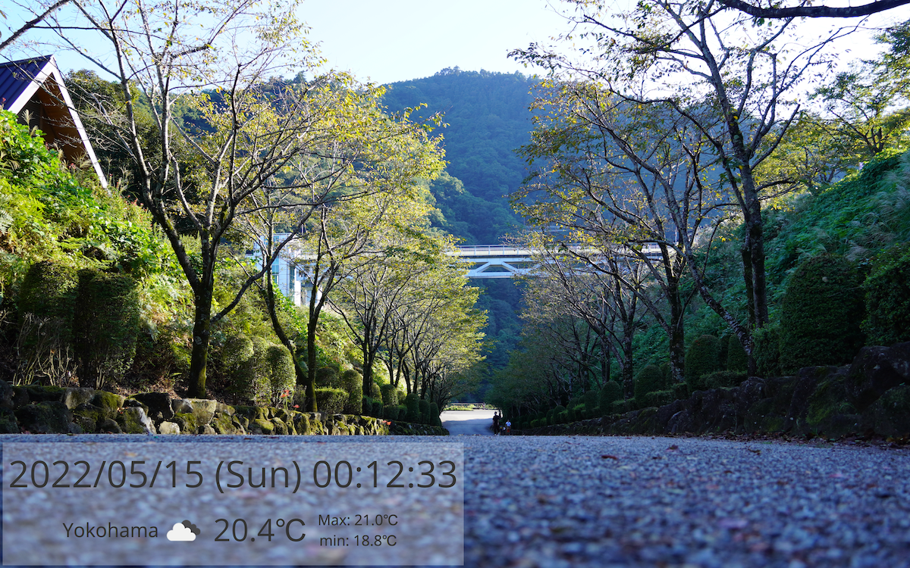
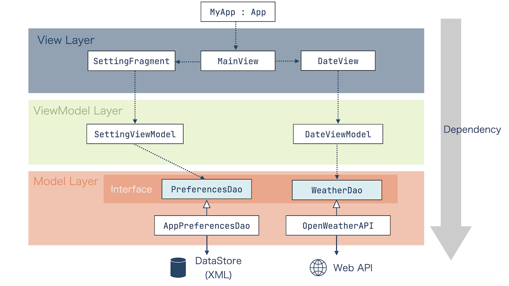

# KtSignage
Work in progress!!

KtSignage is a Simple smart display application worked on Kotlin.

## Build and run
```shell
$ chmod +x gradlew  # at only the first time
$ ./gradlew run
```

## Screenshots
Whole view


## Application design
KtSignage is designed based on MVVM (Model-View-ViewModel).


* MyApp : App
  * has the own coroutine scope whose lifecycle depends on this application one's (we can access with `MyApp.applicationScope`)
* View Layer
  * constructs TornadoFX (JavaFV) View hierarchy
  * has `MainView` as the primary view of this application
* ViewModel Layer
  * has the own coroutine scope (`viewModelScope` whose default dispatcher is `Dispatchers.JavaFX`)
* Model Layer
  * includes `data class` and DAO (Data Access Object) like `PreferencesDao`
  * DAOs must have the own interfaces to debug easily

## LICENSE


### Troubleshooting
#### OpenJFX setting
If you use OpenJFX, add the following `implementation` into `build.gradle.kts`.
```kotlin
dependencies {
    // ...
    // If your path to "OpenJFX lib" is different from the following one, change yours.
    implementation(fileeTree("dir" to "/usr/share/openjfx/lib", "include" to arrayOf("*.jar")))
    // ...
}
```

#### prism_es2 is not found
1. Download OpenJFX directly from [https://openjfx.io/](https://openjfx.io/).
2. Copy `*.so` files into `/usr/share/openjfx/lib`.