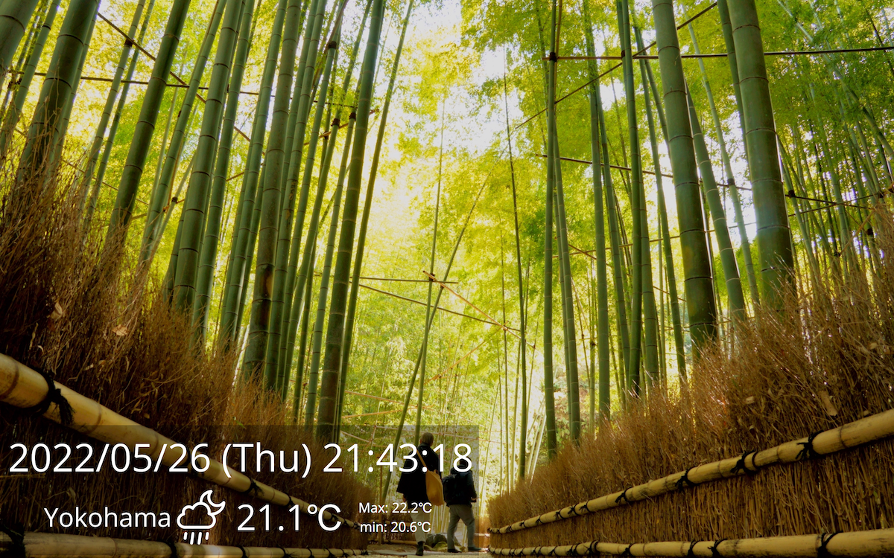

# KtSignage
Work in progress!!

KtSignage is a Simple smart display application worked on Kotlin.

## Screenshots
Whole view

## Application design
KtSignage is designed based on MVVM (Model-View-ViewModel).
